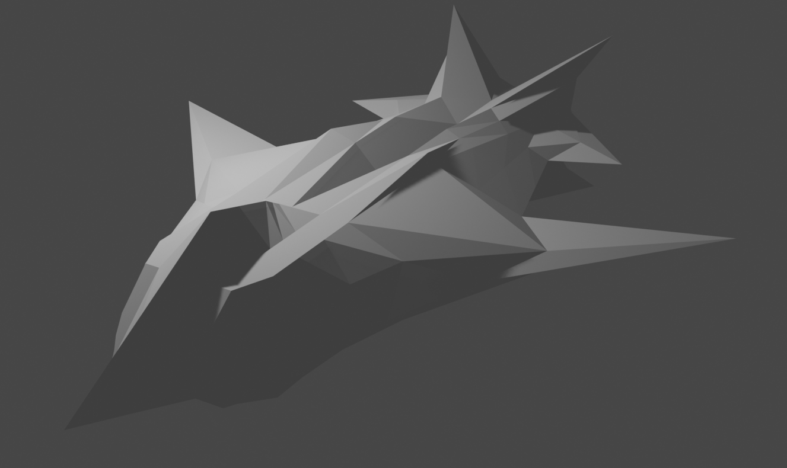

# Carga de Modelos

## Description
This project is a simple 3D rendering application written in C++ using SDL for graphics rendering. It loads 3D models from OBJ files. The main demonstration is with a model named `nave_espacial.obj`, likely a spaceship.

## Installation
To build and run this project, you will need:
- SDL2
- C++ Compiler (e.g., GCC, Clang)
- CMake (optional, for building)

## Usage
To run the program, compile the C++ files and link against the SDL2 library. If you have a custom OBJ file, place it in the project directory and modify the `loadOBJ` line in `main.cpp` to use your file.
